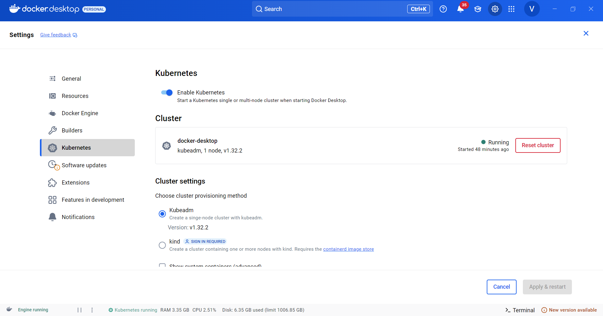
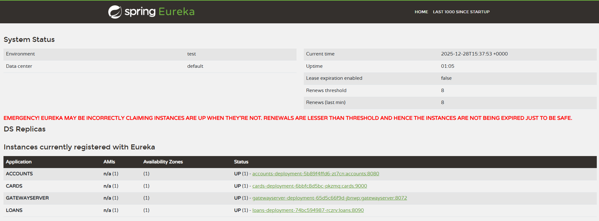
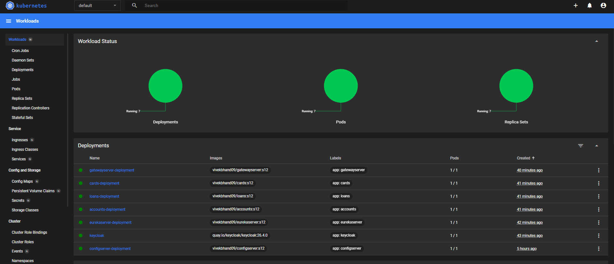
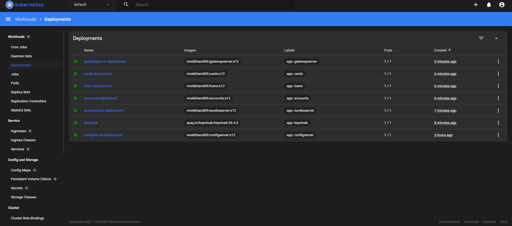
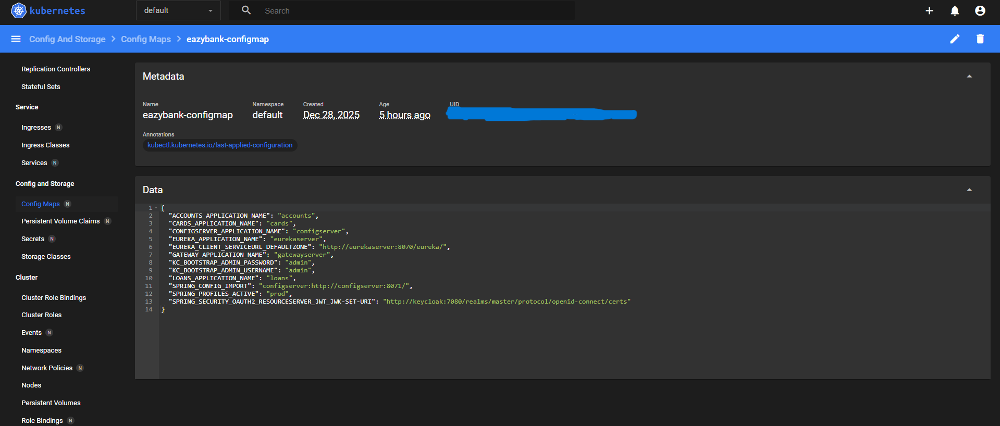
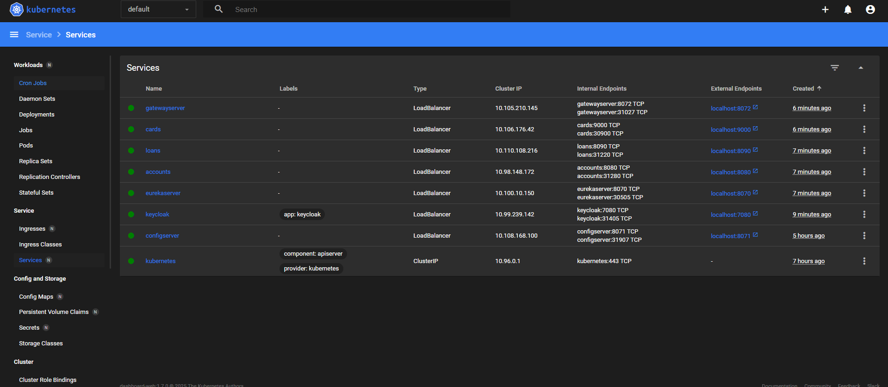
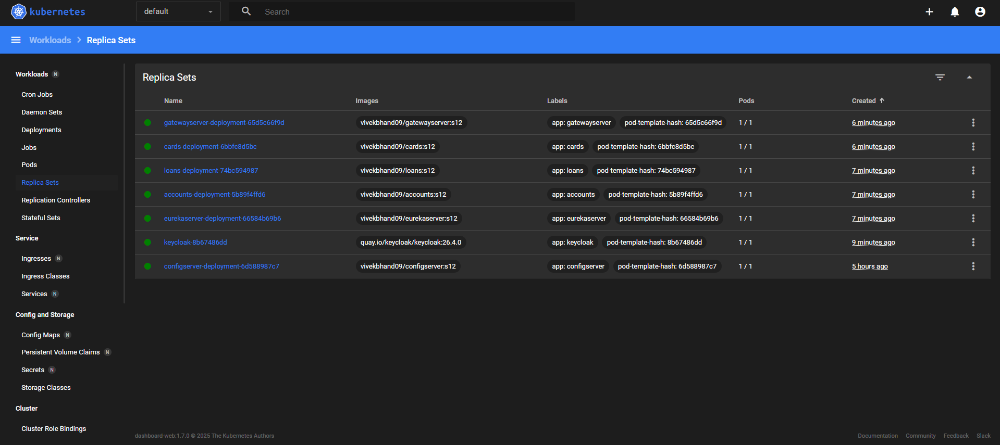
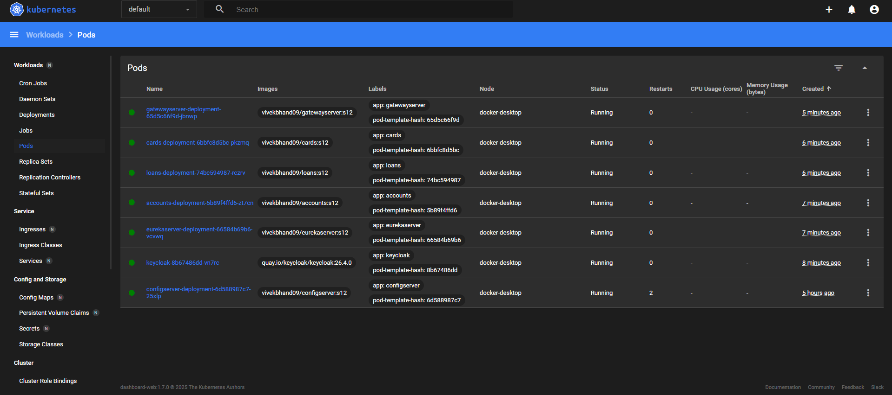

# ☸️ Container Orchestration Using Kubernetes


In this section, we deploy **all EazyBank microservices** into a **local Kubernetes cluster** to manage, scale, and operate containerized applications in a **production-like environment**.

Kubernetes helps us move from *running containers manually* to *running microservices reliably at scale*.

---

## 🚧 Challenges Solved Using Kubernetes

### 1️⃣ Automating Deployment, Rollouts & Rollbacks

#### ❌ Problems
- How to deploy containers to multiple servers
- How to update to a new version without downtime
- What if the new version fails?

#### ✅ Kubernetes Solution
- Declarative deployments using YAML
- Rolling updates with zero downtime
- Automatic rollback on failure
- Versioned deployment history

**Result:** Safe and automated application releases.

---

### 2️⃣ Self-Healing Services

#### ❌ Problems
- What if a container crashes?
- What if it becomes unhealthy?
- What if it is not ready to handle traffic?

#### ✅ Kubernetes Solution
- Automatically restarts crashed containers
- Replaces failed containers with new ones
- Uses **Liveness Probes** to detect unhealthy containers
- Uses **Readiness Probes** to control traffic
- Sends traffic only when the container is ready

**Result:** Applications heal themselves automatically.

---

### 3️⃣ Auto-Scaling Services

#### ❌ Problems
- Sudden traffic spikes
- High CPU or memory usage
- Reduced traffic during off-hours

#### ✅ Kubernetes Solution
- Horizontal Pod Autoscaler (HPA)
- Scales pods based on CPU, memory, or metrics
- Automatically scales down when traffic reduces

**Result:** Efficient resource usage and high performance.

---

## ☸️ What Is Kubernetes?

**Kubernetes (K8s)** is an **open-source container orchestration platform** originally developed by Google and now maintained by the **Cloud Native Computing Foundation (CNCF)**. It is designed to **automate the deployment, scaling, management, networking, and lifecycle of containerized applications** across a cluster of machines.

Kubernetes provides a **declarative, self-healing, and scalable platform** where developers define the *desired state* of an application, and Kubernetes continuously ensures that the actual state of the system matches that desired state.

---

## ❓ Why We Use Kubernetes

- Automated deployments
- High availability
- Self-healing applications
- Auto-scaling
- Zero-downtime updates
- Platform independence

---

## ⭐ Key Features of Kubernetes

- Automated rollouts & rollbacks
- Self-healing containers
- Horizontal scaling
- Service discovery & load balancing
- Configuration & secrets management
- Declarative configuration (YAML)
- Cloud-agnostic architecture


---

## 🧰 Kubernetes CLI & UI

### 🔹 kubectl (CLI)
`kubectl` is the command-line tool used to interact with the Kubernetes cluster.  
It communicates with the kube-apiserver to deploy, manage, and inspect resources.

---

### 🔹 Kubernetes UI (Dashboard)
A web-based interface to visually monitor and manage cluster resources.  
Useful for observing pods, services, deployments, and cluster health.

---

## 🧩 Kubernetes Core Architecture

Kubernetes has **two main parts**:
- **Control Plane**
- **Worker Nodes**

---

## 🧠 Control Plane
The Control Plane is the **brain of Kubernetes**.  
It manages the cluster state and decides **what should run where**.

---

### 🔹 kube-apiserver
The entry point of the cluster.  
All commands and requests go through this component.

---

### 🔹 etcd
A distributed key-value store.  
Stores the entire cluster state and configuration data.

---

### 🔹 Scheduler
Decides **which worker node** a pod should run on.  
It checks CPU, memory, and resource availability.

---

### 🔹 Controller Manager
Ensures the cluster stays in the desired state.  
Automatically fixes issues like failed pods or missing replicas.

---

## ⚙️ Worker Nodes
Worker nodes are where **applications actually run**.  
Each node hosts pods and executes workloads.

---

### 🔹 kubelet
Agent running on each worker node.  
Ensures containers inside pods are running as instructed.

---

### 🔹 Container Runtime
Responsible for running containers.  
Examples include Docker, containerd, and CRI-O.

---

### 🔹 Pod
Smallest deployable unit in Kubernetes.  
Contains one or more containers sharing network and storage.

---

### 🔹 kube-proxy
Manages networking on worker nodes.  
Enables service-to-pod communication and load balancing.

---


## 🔄 How Traffic Flows in Kubernetes

1. **User sends a request**  
   A user or client sends an HTTP/HTTPS request to the application endpoint.

2. **Request reaches Kubernetes Service**  
   The Service provides a stable IP and DNS name, acting as a gateway to the pods.

3. **kube-proxy routes traffic**  
   kube-proxy applies routing rules and load-balances the request across healthy pods.

4. **Traffic forwarded to a Pod**  
   The request is forwarded to one of the running pods selected by the Service.

5. **Pod processes the request**  
   The container inside the pod handles the business logic and generates a response.

6. **Response returned to the user**  
   The response travels back through the Service to the client.

**Kubernetes automatically handles load balancing, failover, and high availability.**


---
# ☸️ Container Orchestration Using Kubernetes (Local Setup & Implementation)

This section documents **how I deployed all microservices into a local Kubernetes cluster** and implemented **self-healing, scaling, and rollout/rollback** using Kubernetes.


## 🚀 Setting Up Local Kubernetes Cluster

I used **Docker Desktop** to set up a local Kubernetes cluster.

### Steps:
1. Open **Docker Desktop**
2. Go to **Settings → Kubernetes**
3. Enable **Kubernetes (Single-node cluster using kubeadm)**
4. Apply & restart Docker Desktop

Once enabled, Kubernetes starts running locally.

### Verifying Cluster
```bash
kubectl config get-contexts
kubectl config get-clusters
kubectl config use-context docker-desktop
kubectl get nodes
```

This confirms the local Kubernetes cluster is running.

---

## 📊 Deploying Kubernetes Dashboard UI

### Installing Chocolatey (Windows)
```powershell
Set-ExecutionPolicy Bypass -Scope Process -Force; 
[System.Net.ServicePointManager]::SecurityProtocol = 
[System.Net.ServicePointManager]::SecurityProtocol -bor 3072; 
iex ((New-Object System.Net.WebClient).DownloadString('https://community.chocolatey.org/install.ps1'))
```

### Installing Helm
```powershell
choco install kubernetes-helm
```

---

## 📦 Installing Kubernetes Dashboard Using Helm

```bash
helm repo add kubernetes-dashboard https://kubernetes.github.io/dashboard/
helm upgrade --install kubernetes-dashboard \
kubernetes-dashboard/kubernetes-dashboard \
--create-namespace \
--namespace kubernetes-dashboard
```

### Access Dashboard
```bash
kubectl -n kubernetes-dashboard port-forward \
svc/kubernetes-dashboard-kong-proxy 8443:443
```

Dashboard URL:
```
https://localhost:8443
```

---

## 🔐 Creating Admin User for Dashboard Access

### Service Account (dashboard-adminuser.yaml)
```yaml
apiVersion: v1
kind: ServiceAccount
metadata:
  name: admin-user
  namespace: kubernetes-dashboard
```

```bash
kubectl apply -f dashboard-adminuser.yaml
```

---

### Cluster Role Binding (dashboard-rolebinding.yaml)
```yaml
apiVersion: rbac.authorization.k8s.io/v1
kind: ClusterRoleBinding
metadata:
  name: admin-user
roleRef:
  apiGroup: rbac.authorization.k8s.io
  kind: ClusterRole
  name: cluster-admin
subjects:
- kind: ServiceAccount
  name: admin-user
  namespace: kubernetes-dashboard
```

```bash
kubectl apply -f dashboard-rolebinding.yaml
```

---

## 🔑 Generating Access Token

### Short-lived Token
```bash
kubectl -n kubernetes-dashboard create token admin-user
```

### Long-lived Token (secret.yaml)
```yaml
apiVersion: v1
kind: Secret
metadata:
  name: admin-user
  namespace: kubernetes-dashboard
  annotations:
    kubernetes.io/service-account.name: "admin-user"
type: kubernetes.io/service-account-token
```

```bash
kubectl apply -f secret.yaml
```

```bash
kubectl get secret admin-user -n kubernetes-dashboard \
-o jsonpath="{.data.token}" | base64 -d
```

Save this token for dashboard login.

---

## 📁 Kubernetes Manifests Structure

Inside the **microservices project**, I created a `kubernetes/` folder to store all Kubernetes YAML files.

---

## ⚙️ Deploying Config Server

### configserver.yml
```yaml
apiVersion: apps/v1
kind: Deployment
metadata:
  name: configserver-deployment
  labels:
    app: configserver
spec:
  replicas: 1
  selector:
    matchLabels:
      app: configserver
  template:
    metadata:
      labels:
        app: configserver
    spec:
      containers:
      - name: configserver
        image: vivekbhand09/configserver:s12
        ports:
        - containerPort: 8071
---
apiVersion: v1
kind: Service
metadata:
  name: configserver
spec:
  selector:
    app: configserver
  type: LoadBalancer
  ports:
  - protocol: TCP
    port: 8071
    targetPort: 8071
```

### Deploy & Verify
```bash
kubectl apply -f configserver.yml
kubectl get deployments
kubectl get services
kubectl get replicasets
kubectl get pods
```

Access:
```
http://localhost:8071
```

---

## 🧩 ConfigMaps (Environment Configuration)

### What is ConfigMap?
A **ConfigMap** stores external configuration like:
- Environment variables
- Application properties
- URLs & credentials (non-sensitive)

It allows changing config **without rebuilding images**.

```bash
kubectl apply -f configmaps.yml
```

---

## 🚀 Deploying All Microservices

```bash
kubectl apply -f 1_keycloak.yml
kubectl apply -f 2_configmaps.yml
kubectl apply -f 3_configserver.yml
kubectl apply -f 4_eurekaserver.yml
kubectl apply -f 5_accounts.yml
kubectl apply -f 6_cards.yml
kubectl apply -f 7_loans.yml
kubectl apply -f 8_gateway.yml
```

### Verify
```bash
kubectl get pods
kubectl get services
kubectl logs <pod-name>
```

---

## 🔐 Keycloak Configuration
- Configure realms
- Clients
- Roles
- Users
- OAuth2 settings

Then test secured microservices using **Postman**.

---

## 🔗 How Deployment & Service Work Together

- **Deployment** defines the desired state of the application, such as how many pod replicas should run, which container image to use, and how updates or rollbacks are handled.
- **Service** provides a stable network identity (IP and DNS) for those pods, even when pods are recreated or scaled.
- Incoming traffic always goes to the **Service**, and the Service automatically forwards requests to healthy pods managed by the Deployment.
- When pods scale up, scale down, or restart, the Service continues routing traffic seamlessly without any change required on the client side.

---

## ♻️ Self-Healing in Kubernetes

- If a pod crashes → Kubernetes restarts it
- If a node fails → Pods are rescheduled
- Desired replicas are always maintained

### Enable Self-Healing
Increase replicas:
```yaml
spec:
  replicas: 3
```

Kubernetes automatically maintains the desired count.

---

## 🔁 Rollout & Rollback in Kubernetes

### Update Image (Rolling Update)
```bash
kubectl set image deployment gatewayserver-deployment \
gatewayserver=vivekbhand09/gatewayserver:s11 --record
```

Kubernetes:
- Deploys new version
- Gradually removes old version
- No downtime

---

## 📜 Rollout History & Rollback in Kubernetes

Kubernetes provides built-in support for **safe application updates** using rollouts and rollbacks.  
This helps teams release new versions confidently and recover quickly if something goes wrong.


## 🔄 Rollout History

```bash
kubectl rollout history deployment gatewayserver-deployment
```

### What is happening here?
- Kubernetes maintains a **revision history** for every Deployment  
- Each revision represents a change such as:
  - New container image
  - Updated configuration
  - Replica count change
- This command lists all previous deployment revisions  
- Helps identify which version was stable and running earlier  

📌 Use case:  
> When a new deployment causes issues, you can inspect older revisions before rolling back.


## ⏪ Rollback to Previous Version

```bash
kubectl rollout undo deployment gatewayserver-deployment --to-revision=1
```

### What is happening here?
- Kubernetes rolls back the Deployment to **revision 1**
- New (problematic) pods are **terminated**
- Old, stable pods are **re-created automatically**
- Traffic is redirected smoothly to healthy pods
- No manual intervention or downtime required

📌 Key benefit:  
> Enables **safe recovery** from failed releases with minimal impact.

---

## 🌐 Kubernetes Service Types

### 1️⃣ ClusterIP
- Default service type
- Accessible only inside the cluster
- Used for internal communication

### 2️⃣ NodePort
- Exposes service on a node port
- Accessible via `<NodeIP>:<Port>`
- Mainly for testing

### 3️⃣ LoadBalancer
- Exposes service externally
- Used in cloud environments
- Automatically provisions load balancer

---
## 📸 Kubernetes Implementation Screenshots (Verification & Monitoring)

Each screenshot validates a specific part of the Kubernetes setup and confirms that the cluster and microservices are working correctly.

---

### 🖼️ 1️⃣ Starting Kubernetes Cluster from Docker  



**Description:**
- Shows Kubernetes enabled inside **Docker Desktop**
- Confirms a **single-node local Kubernetes cluster** is running
- This is the foundation for deploying all microservices

---

### 🖼️ 2️⃣ Eureka Dashboard – All Services Running  



**Description:**
- Displays the **Eureka Service Registry UI**
- Confirms all microservices are:
  - Registered successfully
  - Running inside Kubernetes
- Validates service discovery is working correctly

---

### 🖼️ 3️⃣ Kubernetes Dashboard – Workloads Status  



**Description:**
- Shows overall **workload health**
- Confirms:
  - Deployments are running
  - No failed or crashed workloads
- Validates Kubernetes self-healing behavior

---

### 🖼️ 4️⃣ Deployments View  



**Description:**
- Lists all Kubernetes **Deployments**
- Confirms:
  - Desired replicas = available replicas
  - Rollouts completed successfully
- Ensures application versions are deployed correctly

---

### 🖼️ 5️⃣ ConfigMaps View  



**Description:**
- Displays all **ConfigMaps** used by microservices
- Confirms externalized configuration is managed by Kubernetes
- Enables environment-specific configs without rebuilding images

---

### 🖼️ 6️⃣ Services View  



**Description:**
- Shows Kubernetes **Service objects**
- Confirms:
  - Internal service discovery
  - External access using `LoadBalancer` / `NodePort`
- Ensures stable networking for pods

---

### 🖼️ 7️⃣ ReplicaSets View  



**Description:**
- Displays **ReplicaSets** created by Deployments
- Confirms:
  - Correct number of pod replicas
  - Auto-healing and scaling support
- Helps track rollout versions

---

### 🖼️ 8️⃣ Pods View  



**Description:**
- Shows all running **Pods**
- Confirms:
  - Pods are in `Running` state
  - Containers are healthy
- Final validation that applications are live

---

## 📘 Kubernetes Learning Summary

### 🔹 Fundamentals
- Kubernetes = container orchestration platform
- Manages apps using **desired state**
- Control Plane vs Worker Nodes

### 🔹 Cluster Setup
- Local cluster via Docker Desktop
- Managed contexts & nodes with `kubectl`
- Verified cluster & node health

### 🔹 Core Components
- kube-apiserver, etcd, scheduler, controller manager, kubelet, kube-proxy
- Control plane manages workloads

### 🔹 Pods & Deployments
- Created Deployments for pod lifecycle
- Pods auto-recover, scale, and maintain replicas

### 🔹 Services & Networking
- Services provide stable IP/DNS
- Traffic: `Client → Service → Pod`
- Worked with ClusterIP, NodePort, LoadBalancer

### 🔹 Config & Service Discovery
- Used ConfigMaps to externalize configs
- Deployed Eureka Server for dynamic service discovery

### 🔹 Security
- Integrated Keycloak for OAuth2 authentication
- Secured APIs, tested with Postman

### 🔹 Dashboard
- Installed K8s Dashboard via Helm
- Monitored Pods, Deployments, Services, ConfigMaps, ReplicaSets

### 🔹 Self-Healing & Scaling
- Auto-restart crashed pods, maintain replicas
- Horizontal scaling with replicas & HPA

### 🔹 Rollouts & Rollbacks
- Performed rolling updates, tracked revisions
- Rolled back safely to previous versions

### 🔹 DevOps Readiness
- Hands-on with YAML, declarative deployments, IaC mindset
- Confident in deploying microservices at scale


